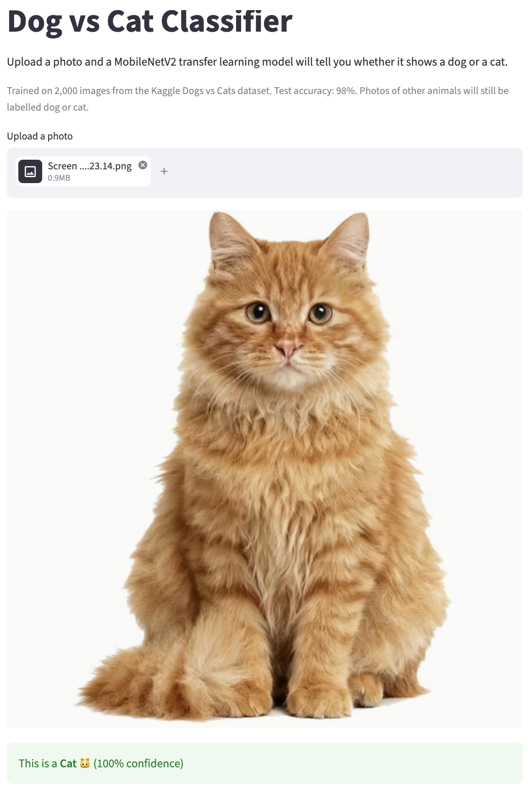

# 🐶🐱 Dog vs Cat Classifier (Transfer Learning)

Classify photos as **dog** or **cat** by reusing a pretrained **MobileNetV2** network.

**🔗 Live app:** [dog-cat-classifier-02.streamlit.app](https://dog-cat-classifier-02.streamlit.app/)



## Results

| Metric | Value |
|---|---|
| Train accuracy (epoch 5) | 99.2% |
| Test accuracy | **98.0%** (392 of 400 correct) |
| Test loss | 0.041 |

## Dataset

- **Source:** Kaggle competition [Dogs vs. Cats](https://www.kaggle.com/c/dogs-vs-cats)
- **Size:** 25,000 labeled training photos (12,500 dogs, 12,500 cats)
- **Used here:** 2,000 images (983 cats, 1,017 dogs)
- **Target:** 0 = cat, 1 = dog (labels created from the file names)

## Approach

1. Downloaded and extracted the dataset with the Kaggle API.
2. Resized 2,000 images to 224 × 224 RGB and converted them into a NumPy array of shape `(2000, 224, 224, 3)`.
3. Split the data 80% / 20% (1,600 train, 400 test).
4. Scaled pixel values to the 0–1 range.
5. Loaded **MobileNetV2** (feature vector from TensorFlow Hub, frozen) and added one `Dense(2)` output layer.
6. Trained with Adam and `SparseCategoricalCrossentropy(from_logits=True)` for 5 epochs.
7. Built a predictive system and tested it on my own photos.
8. Deployed the model as a Streamlit web app.

## Deployment notes

- **Same preprocessing in training and in the app.** Training images were loaded with `cv2.imread`, which returns pixels in BGR order. The app opens uploads with Pillow (RGB), so it flips the channels to BGR before predicting. Without this, red and blue would be swapped and accuracy would drop.
- **Mobile-friendly uploads.** Large phone photos are shrunk before processing, and rotated photos are corrected using their EXIF data.
- **Pinned versions.** Package versions match the Colab training environment (TensorFlow 2.20, tf_keras 2.20.1, TensorFlow Hub 0.16.1) to avoid model loading problems.
- **Model caching.** The model is loaded once with `st.cache_resource`, so predictions after the first one are fast.

## Tech stack

Python · TensorFlow / tf_keras · TensorFlow Hub · NumPy · OpenCV · Pillow · scikit-learn · Streamlit · Google Colab

## Project structure

```
dog-cat-classifier/
├── app.py               # Streamlit web app
├── dog_cat_model.h5     # trained model
├── requirements.txt     # pinned dependencies
└── README.md
```

## Run locally

```bash
git clone https://github.com/YOUR_USERNAME/dog-cat-classifier.git
cd dog-cat-classifier
pip install -r requirements.txt
streamlit run app.py
```

## Limitations and next steps

- Only 2,000 of the 25,000 images are used. Training on more data is an easy improvement.
- No validation set during training and no data augmentation (flips, rotations, zoom).
- The pretrained network is frozen. Fine-tuning the last layers could help.
- Only accuracy is reported. A confusion matrix and training curves would give a fuller picture.
- The model only knows two classes, so photos of other animals are still labelled dog or cat.

## Author

**Arshavir Voskanyan**
